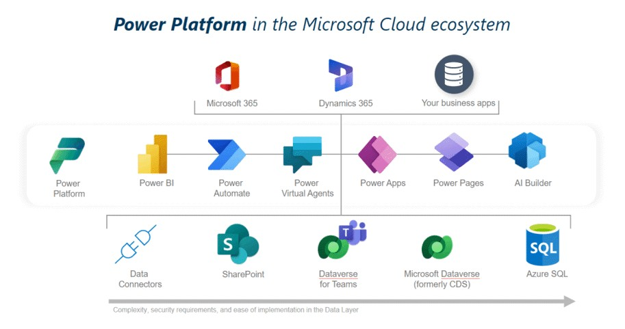

# Power Platform áttekintés
> Releváns komponensek általános áttekintése
---
## Mi a Power Platform?  

A Power Platform az alábbi low‑code eszközökből áll:  
- [Power Apps](#mi-az-a-power-apps) – egyedi üzleti alkalmazások fejlesztéséhez (web + mobil)  
- [Power Automate](#mi-az-a-power-automate) – folyamatok és integrációk automatizálására  
- [Dataverse](#mi-az-a-dataverse) – központi adatplatform, strukturált adatkezeléshez  
- (Power BI, Power Pages, Power Virtual Agents – most nem fókusz)  

## Miért jó választás IT szempontból?  

- Moduláris, integrált ökoszisztéma: Az eszközök együttműködnek – egy Power App indíthat egy flow‑t, ami Dataverse‑ben tárol adatot, majd Power BI‑ban megjelenítjük. Ez újrahasznosítható, építőkocka szemléletet támogat.  
- Enterprise integráció: Több mint 300 beépített connector SQL‑hez, SharePoint‑hoz, API‑khoz, legacy rendszerekhez (pl. RPA), Azure‑hoz. Meglévő SQL adatainkat könnyedén elérhetjük, nem kell egyedi kód az integrációhoz.  
- Biztonság és kontroll: Azure AD azonosítás (amit már használunk), role‑based access a Dataverse‑ben, Power Platform Admin Center a teljes átláthatósághoz (appok, flow‑k, felhasználók, logok, DLP policy‑k). IT kontroll megmarad.  
- Skálázhatóság: Azure alapokon működik, nagyvállalati terhelésre tervezve (pl. Dynamics 365 is ezt használja). Ha nő az igény, elég kapacitást bővíteni – nem kell újraépíteni semmit.  

## Mi az a Power Apps?  
A Power Apps egy low‑code eszköz, amellyel webes és mobil üzleti alkalmazásokat fejleszthetünk gyorsan. A felületet vizuálisan építjük fel, az üzleti logikát pedig Power Fx formulákkal írjuk – ezek szintaxisa nagyon hasonlít az Excel‑képletekéhez.

Két fő apptípus létezik:

- Canvas app – szabadon tervezhető UI, teljes dizájnkontroll (pl. Számla leadás app)
- Model‑driven app – adatvezérelt megközelítés, ahol a Dataverse adatszerkezet határozza meg az app kinézetét. Ideális összetettebb üzleti folyamatokhoz (pl. ticket‑ vagy szerződéskezelés)

## Mi az a Power Automate?
A Power Automate egy low‑code workflow‑eszköz, amellyel automatizált folyamatokat (cloud flows) hozhatunk létre. Egy flow mindig egy triggerrel (pl. beérkező e‑mail, gombnyomás, időzített futás vagy egy rekord létrehozása/változása adatbázisban) indul, majd sorban lefutó műveletekből (actions) épül fel, amelyeket feltételekkel, ciklusokkal és változókkal finomíthatunk. A több mint 1000 előre elkészített connector segítségével pár kattintással összeköthetjük az Office 365‑öt, a Google Drivet, Teams‑et, az SAP‑t, a Jirat vagy bármely más SaaS‑t, és akár saját (custom) connector is létrehozható.

Három fő flowtípus létezik:
- Cloud flow – felhőalapú integráció, amely automatikus (event‑alapú), azonnali vagy ütemezett módon futtatható.
  > Jira Logger automatizmus, jóváhagyási és adatbáziskezelési folyamatok Számla leadás appban
- Desktop flow – RPA‑alapú robot, amely Windows‑os gépen a felhasználói felületet vezérelve automatizál web‑ és asztali alkalmazásokat, így legacy rendszerekbe is képes adatot rögzíteni (pl. tömeges Excel‑adatbevitel egy régi ERP‑be)
- Business process flow – vezetett, több szakaszos folyamatsáv a Dataverse‑ben, amely lépésről lépésre tereli a felhasználókat összetettebb üzleti folyamatokon (pl. értékesítési pipeline, project lifecycle)

Gyakori use‑case‑ek: jóváhagyási láncok, valós idejű értesítések, fájlszinkronizálás, adatgyűjtés és ‑továbbítás különféle rendszerek között.

## Mi az a Dataverse?
A Dataverse egy Microsoft által menedzselt, felhőalapú relációs adatplatform (korábban Common Data Service), amelyet kifejezetten a Power Platform‑hoz optimalizáltak. Az adatokat táblákban (standard vagy egyéni) tároljuk, melyek felépítése megegyezik a klasszikus relációs adatbázisokéval.

Fő beépített képességek:
- Gazdag adattípus‑készlet – a hagyományos szöveg / szám / dátum mezőkön túl elérhetők választólisták, keresők, valamint file‑ és image‑típusok nagyobb bináris tartalmakhoz
- Kapcsolatok és üzleti logika – definíció‑szinten hozhatunk létre 1‑N, N‑N kapcsolatokat, üzleti szabályokat, kiszámított vagy roll‑up oszlopokat, valamint audit‑ és verziókövetést, mindezt low‑code módon a Maker‑portálon.
- Role‑based + row‑level biztonság – a Dataverse szerepkör‑alapú (RBAC) és sor‑/mező‑szintű jogosultságmodellel védi az adatokat; a szerepkörök öröklődnek üzleti egységek és csapatok között, a legmagasabb jogosultság érvényesül
- Integráció és nyílt API‑k – több mint ezer Power Platform‑connector segít a külső SaaS‑ok bekapcsolásában. Emellett elérhető OData/REST Web API, T‑SQL endpoint (SQL Azure‑kapcsolat) és beágyazott plug‑in SDK, így a fejlesztők és BI‑szakemberek is könnyen hozzáférnek az adatokhoz
- ALM és környezetek – megoldáscsomagok (solutions) segítségével verziózható és mozgatható a séma, a logika és az adatmig­ráció dev‑test‑prod környezetek között. A tárhely‑fogyasztás (database / file / log) kapacitás‑alapúan licencelt

A Dataverse tehát nem csupán tároló, hanem egy komplett, skálázható adat‑ és szabálymotor, amely biztonságosan szolgálja ki a teljes Power Platform ökoszisztémát.

<!-- ### Pro‑code integráció lehetőségei  

A Power Platform nem zárja ki a hagyományos fejlesztés integrációját. 
- Power Apps Component Framework (PCF) – saját UI vezérlők fejlesztése JavaScript/TypeScript nyelven.  
- Custom connectors / API integráció – Power Apps‑ből lehetőség van REST API hívásokra, Azure Functions futtatására.  
- ALM támogatás – appok verziókövetése, Git tárolása, dev‑test‑prod környezetek kialakítása megoldható, a vállalati DevOps folyamatokhoz igazítva.  

## Összefoglalva  

A Power Apps egy olyan eszköz, amely:  
- gyors (napok‑hetek alatt kész megoldásokat hoz),  
- rugalmas (canvas és model‑driven megközelítések),  
- kiterjeszthető (pro‑code irányba is),  
- és az IT kezében marad (governance, jogosultságok, verziókezelés).   -->
